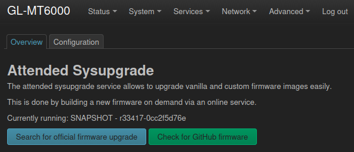
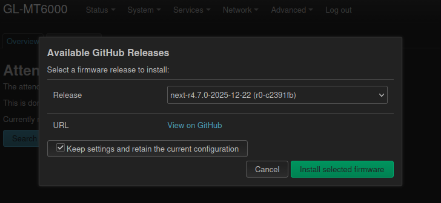
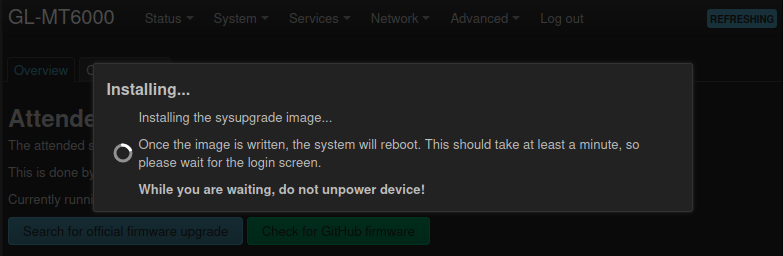
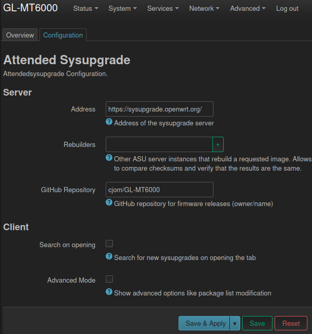

# GL-MT6000 custom OpenWrt firmware builder

This repository automates the process of building OpenWrt custom firmware images for **MY** Flint 2 (GL-MT6000) router, based on **MY PREFERENCES** and [pesa1234](https://github.com/pesa1234)'s work.

This is a fork of [cjom/GL-MT6000](https://github.com/cjom/GL-MT6000) and has diverged from it: AdBlock Fast has been replaced with AdGuardHome, banip and CrowdSec have been added, and `files/` carries router-specific customizations that upstream does not have.

You should **not use** the firmwares released in this repository unless you have the same preferences/needs.
Instead, **make a fork and adapt to your needs**.

Read [this topic](https://forum.openwrt.org/t/mt6000-custom-build-with-luci-and-some-optimization-kernel-6-12-x/185241) in OpenWrt's forum to learn the details about pesa1234's customizations.

Compared to his custom firmware, this firmware adds:
- **WiFi UCODE scripts** (faster boot)
- **Wireguard VPN**
- **Policy Based Routing** (select what goes through VPN and what not)
- **AdGuardHome** (ads and malware blocking at DNS level, with a web UI)
- **banip** and **CrowdSec firewall bouncer** (IP reputation blocking)
- **Custom Attended Sysupgrade** (install custom firmware from GitHub)

And also:
- **REMOVED:** samba, usb storage, prometheus-node-exporter and probably more stuff I forgot to mention. (upstream also removes odhcp, upnp, iptables and avahi — this fork keeps them.)
- Added the needed packages to use QoS script [cake-wg-pbr](https://github.com/lynxthecat/cake-wg-pbr)
- Some compiler optimizations and build hardening options (cortex-a53+crc+crypto; LTO, MOLD, and more).
- SSH configuration with strong algorithms and key exchange methods. Check the content of [`ssh_hardening.config`](files/etc/ssh/sshd_config.d/ssh_hardening.conf) and [`sshd_config`](files/etc/ssh/sshd_config).
- Quality-of-life enhancements through UCI configuration. Check the content of [`99_QOL_config`](files/etc/uci-defaults/99_QOL_config).
- Some debug and kernel stuff removed.
- [`upgrade_custom_openwrt`](files/usr/bin/upgrade_custom_openwrt) script
- Router customizations baked into the image so a factory reset restores them — see [What survives a flash](#what-survives-a-flash).

Check the content of [`mt6000.config`](mt6000.config) for details.


## About Custom Attended Sysupgrade

Using Luci's menu "System" --> "Attended Sysupgrade" it is now possible to select and install custom firmware from GitHub.
  
<sub>Custom Attended Sysupgrade</sub>  

  
<sub>Dropdown list</sub>  

  
<sub>Installing Custom Firmware</sub>  

  
<sub>GitHub repository</sub>  

  
Notes:
- if you fork this repository, this will be adapted to look for upgrades in your repository by default.


## About upgrade_custom_openwrt script

```
THIS IS NOW DEPRECATED, ALTHOUGHT THE SCRIPT IS STILL INCLUDED
```

I added a script to make upgrading OpenWRT super easy. Just run from a SSH terminal:
- `upgrade_custom_openwrt --now` to check if a newer firmware is available and upgrade if so.
- `upgrade_custom_openwrt --wait` to wait for clients activity to stop before upgrading.
- `upgrade_custom_openwrt --check` to check for new versions but not upgrade the router.

**IT IS NOT RECOMMENDED** to schedule the script to be executed automatically, although the script is very careful and checks sha256sums before trying to upgrade. Don't blame me if something goes wrong with scripts that **YOU** run in your router!

Notes:
- if you fork this repository, the script will be adapted to look for upgrades in your repository.
- The text output of upgrade_custom_openwrt script will show both in terminal and system logs.


## About SSH Hardening

To enhance the security of SSH connections, this firmware includes a hardened SSH configuration. The configuration is derived from recommendations by [SSH-Audit](https://github.com/jtesta/ssh-audit) and the [BSI](https://www.bsi.bund.de/), it specifies strong key exchange algorithms, ciphers, message authentication codes (MACs), host key algorithms, and public key algorithms. This ensures that only secure and up-to-date algorithms are used for SSH communication.


## What survives a flash

Two separate mechanisms, easy to confuse:

| Mechanism | Survives sysupgrade | Survives factory reset |
|---|---|---|
| `files/` (baked into the image) | yes | **yes** |
| `/etc/sysupgrade.conf` (keep list) | yes | no |

Anything that only ever existed on the live router is lost on a factory reset. These are now in `files/` so the image rebuilds them:

- [`agh-archive.sh`](files/usr/bin/agh-archive.sh) — compresses AdGuardHome's rotated query log into cold storage
- [`zzz-agh-archive.sh`](files/lib/upgrade/zzz-agh-archive.sh) — sysupgrade hook, see below
- [`sysupgrade.conf`](files/etc/sysupgrade.conf) — the keep list itself
- [`10-upload-limit.nft`](files/etc/nftables.d/10-upload-limit.nft) — per-MAC egress rate limit
- [`apk-cheatsheet.sh`](files/etc/profile.d/apk-cheatsheet.sh) — opkg-to-apk reminder on login
- [`htoprc`](files/root/.config/htop/htoprc) — htop column layout
- `roblox-iplist.txt` — CIDR list for policy routing

### AdGuardHome data

AdGuardHome keeps its state in `/opt/adguardhome`, which sysupgrade does **not** preserve by default. Roughly 220 MB lives there, but only about 23 MB of it is real state:

```
206M  data/          of which:
138M    querylog.json.1   transient - archived instead, see below
 60M    querylog.json     transient - live log
8.2M    filters
256K    stats.db
 32K    sessions.db
 14M  archive/       the actual history, already gzipped
```

`sysupgrade.conf` therefore keeps `archive/`, `filters/`, `stats.db` and `sessions.db`, and deliberately **excludes** the two `querylog.json*` files.

That exclusion is not an oversight. Sysupgrade stages its keep list as a tarball in `/tmp`, which is tmpfs — RAM. This router has 1 GB and `CONFIG_KERNEL_SWAP` is off, so there is no swap to fall back on. Tarring 200 MB of transient log into RAM while the flash is being written is a good way to lose an upgrade. With the exclusion the backup measures ~17 MB against ~492 MB of free tmpfs.

The query history is not lost, because `agh-archive.sh` gzips `querylog.json.1` into `archive/` before it is overwritten by the next rotation, and `archive/` *is* preserved.

### The sysupgrade hook

Cron runs `agh-archive.sh` nightly, so without help the preserved archive would only be as fresh as the last 03:30 run. [`zzz-agh-archive.sh`](files/lib/upgrade/zzz-agh-archive.sh) closes that gap by snapshotting the log at the moment of the upgrade.

It uses a documented extension point rather than patching anything. `/sbin/sysupgrade` sets `$sysupgrade_init_conffiles`, then sources every `*.sh` in `/lib/upgrade/`, then calls `run_hooks "$CONFFILES" $sysupgrade_init_conffiles`. Because `run_hooks()` iterates its arguments as a word list and that expansion is unquoted, prepending a function name to the variable makes it run before the keep list is enumerated. The `zzz-` prefix guarantees the file is sourced after the variable is set.

Three deliberate properties:

- **`sysupgrade -l` is guarded.** Listing the keep list should not spend a minute gzipping 140 MB, so the hook checks `$CONF_BACKUP_LIST` and returns early.
- **It cannot break an upgrade.** A missing script, a missing data directory or a failed gzip all return success with a warning. Worst case you flash with a slightly stale archive.
- **It is idempotent.** The archive is named from the source log's mtime and skipped if the destination is already newer, so repeated runs are free.

### qosmate

[qosmate](https://github.com/hudra0/qosmate) is installed outside the package manager, so nothing in the image restores it. It is not vendored into this repository — instead `sysupgrade.conf` preserves all of it, including the LuCI web UI under `/www/luci-static/resources/view/qosmate` and the rpcd backends, which the original four-line entry was missing.

After a **factory reset** qosmate must be reinstalled from upstream; the keep list only covers sysupgrade.

### Not in this repository

This repo is public, so router state containing secrets is deliberately excluded and must be backed up separately: SSH host keys, `/root/.ssh/authorized_keys`, the uhttpd TLS key, `/etc/config/wireless` (WiFi PSKs) and `/etc/adguardhome/adguardhome.yaml` (password hash). All of these are already covered by the sysupgrade keep list, so they survive a flash — they just are not, and should not be, in git.

## Contributing

Contributions to this project are welcome. If you encounter any issues or have suggestions for improvements, please open an issue or submit a pull request on the GitHub repository.


## Acknowledgements

- The OpenWrt project for providing the foundation for this firmware build and support of [GL.iNet GL-MT6000](https://openwrt.org/toh/gl.inet/gl-mt6000) router.
- The community over at the [OpenWrt forum](https://forum.openwrt.org/t/mt6000-custom-build-with-luci-and-some-optimization-kernel-6-12-x/185241) for their valuable contributions and resources. 
- [pesa1234](https://github.com/pesa1234) for his [MT6000 custom builds](https://github.com/pesa1234/MT6000_cust_build).
- [Julius Bairaktaris](https://github.com/JuliusBairaktaris/Qualcommax_NSS_Builder) from whom I "borrowed" much of this project (his repository is about custom builds for Xiaomi AX3600).
